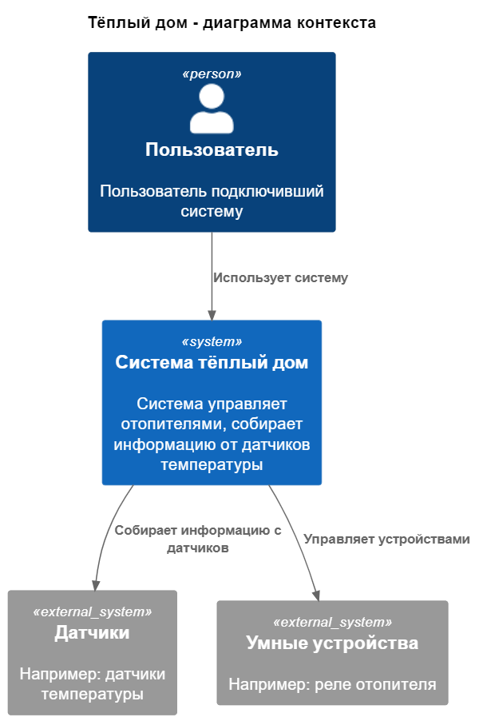
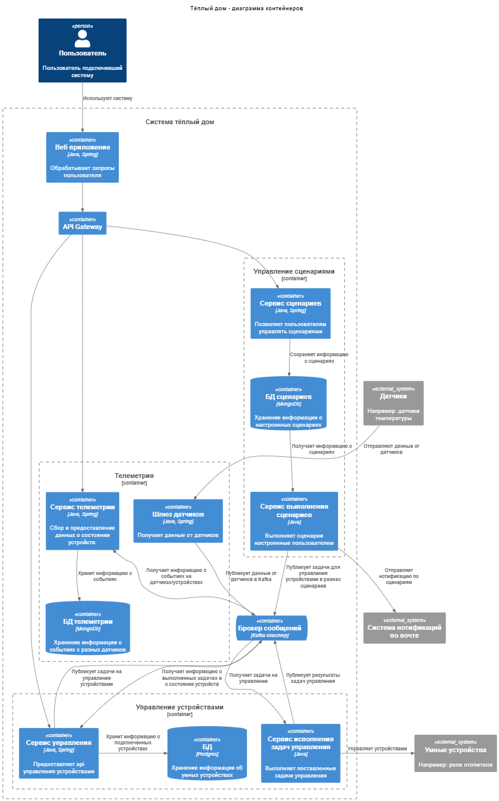
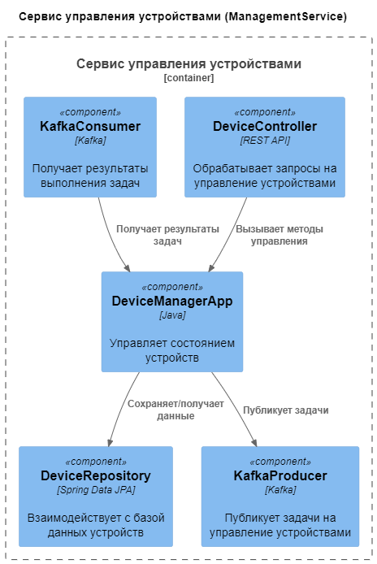
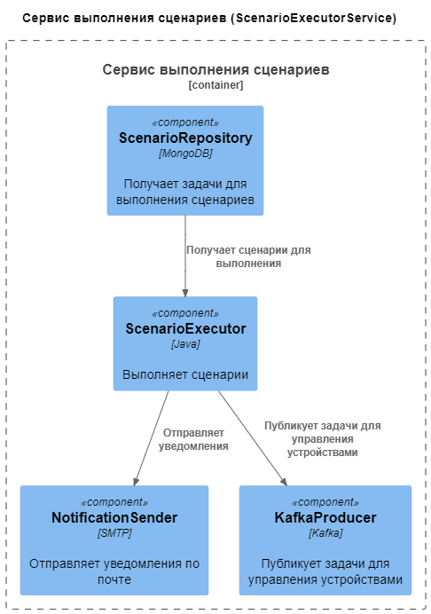
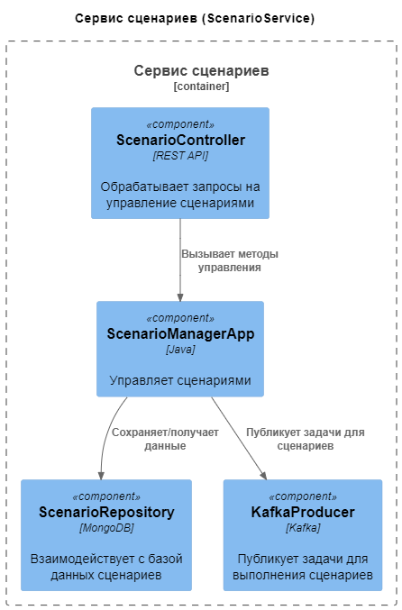
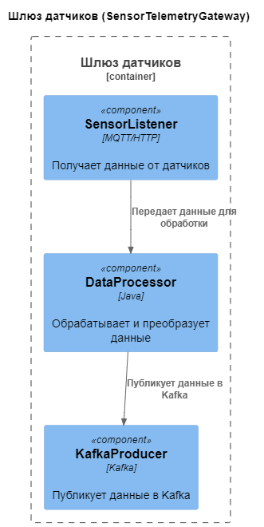
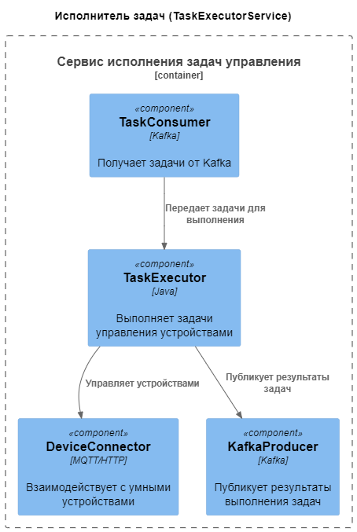
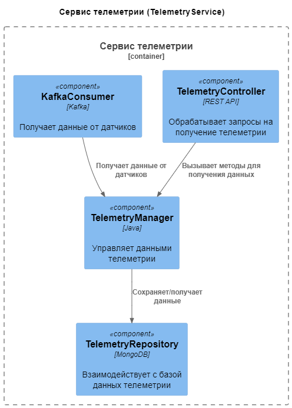
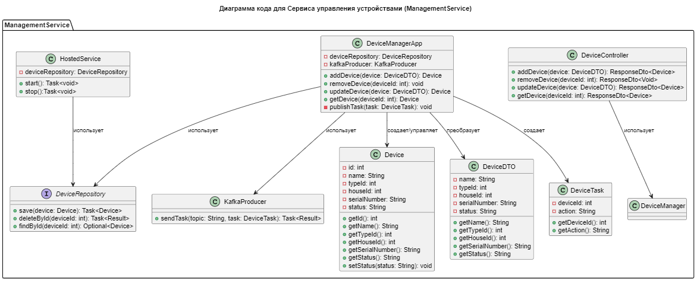
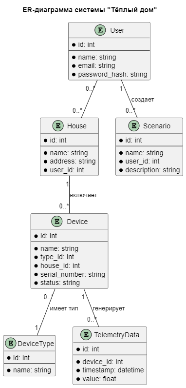

Это шаблон для решения **первой части** проектной работы. Структура этого файла повторяет структуру заданий. Заполняйте его по мере работы над решением.

# Задание 1. Анализ и планирование

Чтобы составить документ с описанием текущей архитектуры приложения, можно часть информации взять из описания компании условия задания. Это нормально.

### 1. Описание функциональности монолитного приложения

**Управление отоплением:**

- Пользователи могут установить требуемую температуру
- Пользователи могут выключить систему отопления
- Пользователи могут включить систему отопления

**Мониторинг температуры:**

- Пользователи могут получить информацию о текущей температуре
- Система поддерживает собирает информацию о температуре с датчиков

### 2. Анализ архитектуры монолитного приложения

Характеристики текущего приложения:
- монолитное приложение
- язык программирования Java
- СУБД Postrges
- взаимодействие компонентов синхронное
- информация о температуре получается при запросе от сервера к датчику

### 3. Определение доменов и границы контекстов

1. Управление устройствами
2. Сценарии
3. Телеметрия
4. Нотификация

### **4. Проблемы монолитного решения**

Синхронное взаимодействие.

Сложность масштабирования отдельных частей системы. Например домен телеметрии должен собирать информацию с большого количества датчиков, возможно потребуется масштабирование, но в текущем решении придется масштабировать все приложение.

Высокий риск ошибок, изменения в одном функционале могут сломать другой. 
Система активно развивается, для конкуренции на рынке нужно поддерживать как можно больше протоколов/устройств умного дома и обезопасить рабочии модули от постоянных изменений.

### 5. Визуализация контекста системы — диаграмма С4

[Диаграмма контекста в модели C4](./docs/c4/asis-context.puml) 

# Задание 2. Проектирование микросервисной архитектуры

В этом задании вам нужно предоставить только диаграммы в модели C4. Мы не просим вас отдельно описывать получившиеся микросервисы и то, как вы определили взаимодействия между компонентами To-Be системы. Если вы правильно подготовите диаграммы C4, они и так это покажут.

**Диаграмма контейнеров (Containers)**

[Диаграмма контекста в модели C4](./docs/c4/tobe-containers.puml) 

**Диаграмма компонентов (Components)**

[Диаграмма компонента "Сервис управления устройствами" в модели C4](./docs/c4/tobe-component-management-service.puml)

[Диаграмма компонента "Сервис выполнения сценариев" в модели C4](./docs/c4/tobe-component-scenario-executor-service.puml)

[Диаграмма компонента "Сервис сценариев" в модели C4](./docs/c4/tobe-component-scenario-service.puml)

[Диаграмма компонента "Шлюз датчиков" в модели C4](./docs/c4/tobe-component-sensor-telemetry-gateway.puml)

[Диаграмма компонента "Сервис исполнения задач управления" в модели C4](./docs/c4/tobe-component-task-executor-service.puml)

[Диаграмма компонента "Сервис телеметрии" в модели C4](./docs/c4/tobe-component-telemetry-service.puml)

**Диаграмма кода (Code)**

[Диаграмма кода "Сервиса управления устройствами" в модели C4](./docs/c4/tobe-code-management-service.puml)

# Задание 3. Разработка ER-диаграммы

[Диаграмма ER](./docs/er/tobe-er.puml)

